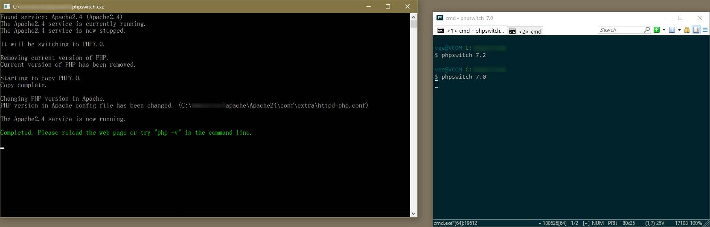

# PHPSwitch

Switch between PHP versions using command line on Windows.

## Requirement:
Windows (I'm not sure that 7, 8, or 10 at least) 64 bit.
.NET Framework 4.6.1
Administrator privilege (Windows UAC).

## Usage:
Run `phpswitch` command and follow with version number. Example: `phpswitch 7.1` to switch to PHP 7.1.

